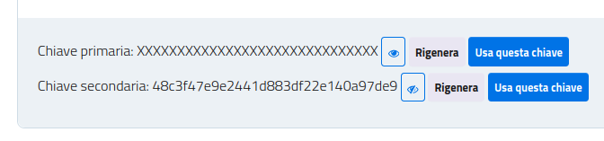

######################
Command-line interface
######################

:mod:`io_beep_boop` includes a command line interface to (hopefully) facilitate the execution of certain tasks with the IO API.

The interface can be invoked by entering the following in environments where the package is installed:

.. code-block:: console

    $ io-beep-boop

All commands can be suffixed with ``--help`` to read their documentation:

.. code-block:: console

    $ io-beep-boop --help
    Usage: io-beep-boop [OPTIONS] COMMAND [ARGS]...

    Options:
      -t, --token TEXT  One of the two IO App API tokens of the service you want
                        to use.
      --base-url TEXT   The base URL of the IO App API to use.
      --help            Show this message and exit.

    Commands:
      registered-fast
      registered-slow

All tasks require a valid API key obtained from the `IO Developer website <https://developer.io.italia.it/profile>`_:

    Example key in the IO Developer website.

API keys can be passed programmatically as the ``--token`` parameter, or manually when prompted by the CLI:

.. code-block:: console

    $ io-beep-boop --token="XXXXXXXXXXXXXXXXXXXXXXXXXXXXXX"

.. code-block:: console

    $ io-beep-boop
    Token:

Discover who is registered to a given service
=============================================

Given a text file containing a list of fiscal codes separated by newlines, :mod:`io_beep_boop` can find which ones are registered to a certain IO service.

Using the fast method
---------------------

.. todo::

    Description of the fast method.

.. code-block:: console

    $ io-beep-boop registered-fast

Using the slow method
---------------------

.. todo::

    Description of the fast method.

.. code-block:: console

    $ io-beep-boop registered-slow
